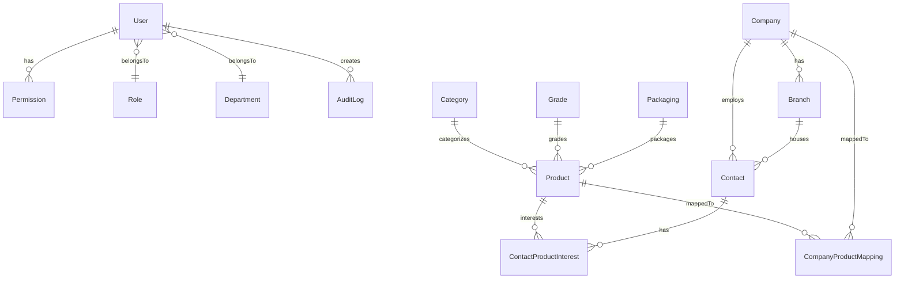

# Database Schema Documentation

This document describes the MySQL database schema for the Product & Buyer Management System (PBMS), managed via Prisma ORM.

## Entity-Relationship Overview

The database contains 15 primary tables. The relations are structured as follows:

## Enums

| Enum | Values | Description |
|------|--------|-------------|
| `RoleName` | `SUPER_ADMIN`, `ADMIN`, `STAFF` | User role labels (do not control permissions directly) |
| `Status` | `ACTIVE`, `INACTIVE` | Used across all master tables for soft deletes |
| `CompanyType` | `MANUFACTURER`, `SUPPLIER`, `BUYER`, `DISTRIBUTOR` | Business category for companies |
| `MappingRole` | `SELLER`, `BUYER` | Defines the company's relationship to a product |

---

## 1. Auth & Users

### `User`
Core user account table.
- **PK:** `user_id` (Int)
- **Fields:** `name`, `email`, `password_hash`, `mobile`, `status`
- **Relations:** Belongs to `Role`, `Department`. Has many `Permission`, `AuditLog`.

### `Permission`
User-Based Access Control (UBAC) matrix.
- **PK:** `permission_id` (Int)
- **Unique Constraint:** `[user_id, module_name]`
- **Fields:** `module_name` (String), `can_view`, `can_create`, `can_edit`, `can_delete` (Boolean)
- **Relations:** Belongs to `User`.

### `Role` & `Department`
Lookups for user categorization.
- **PK:** `role_id` / `department_id` (Int)
- **Fields:** `role_name`, `department_name`, `description`

### `AuditLog`
Tracks `CREATE`, `UPDATE`, `DELETE` operations across the system.
- **PK:** `log_id` (Int)
- **Fields:** `user_id`, `action`, `module`, `record_id`, `old_values`, `new_values`, `ip_address`

---

## 2. Product Master

### `Product`
The central catalog of products.
- **PK:** `product_id` (Int)
- **Unique Constraint:** `sku`
- **Fields:** `product_name`, `sku`, `description`, `hsn_code`, `gst_rate`, `reorder_level`, `status`, etc.
- **Relations:** Belongs to `Category`, `Grade`, `Packaging`. Has many `CompanyProductMapping`.

### Masters: `Category`, `Grade`, `Packaging`
Setup tables for Product attributes.
- **PK:** `category_id`, `grade_id`, `packaging_id` (Int)
- **Unique:** `category_name`, `grade_name`, `packaging_name`
- **Packaging Extra:** `size_value` (Decimal), `size_unit` (String)

---

## 3. Company & Contact Master

### `Company`
Business entities (Buyers, Suppliers, etc).
- **PK:** `company_id` (Int)
- **Fields:** `company_name`, `company_type`, `email`, `phone`, `gst_number`, `status`
- **Relations:** Has many `Branch`, `Contact`, `CompanyProductMapping`.

### `Branch`
Physical locations of companies.
- **PK:** `branch_id` (Int)
- **Fields:** `company_id`, `branch_name`, `gst_number`, `address_line1`, `latitude`, `longitude`
- **Relations:** Belongs to `Company`. Has many `Contact`.

### `Contact`
Individual people employed by companies.
- **PK:** `contact_id` (Int)
- **Fields:** `company_id`, `branch_id`, `first_name`, `last_name`, `email`, `mobile`, `status`
- **Relations:** Belongs to `Company`, `Branch`. Has many `ContactProductInterest`.

---

## 4. Mappings & Intersections

### `CompanyProductMapping`
Represents a Company buying or selling a Product.
- **PK:** `mapping_id` (Int)
- **Unique Constraint:** `[company_id, product_id, role]` (A company can only be mapped as a SELLER once per product)
- **Fields:** `price_range_min`, `price_range_max`, `moq`, `lead_time_days`, `is_active`

### `ContactProductInterest`
Represents products a Contact is interested in.
- **PK:** `interest_id` (Int)
- **Unique Constraint:** `[contact_id, product_id]`

---

## Data Conventions

### Soft Deletes
The system strictly prohibits physical `DELETE` operations.
- Entities have a `status` field (`ACTIVE` / `INACTIVE`).
- Mappings have an `is_active` boolean field.
- Deleting an entity (e.g. Company) automatically soft-deletes its child entities (Mappings).

### Timestamps
Every table includes standard audit timestamps:
- `created_at` (DateTime, default `now()`)
- `updated_at` (DateTime, updated on change)